# Arch1tech
**Powered by Or4cl3 AI Solutions**  
*Build the future, one thought at a time.*

<div align="center">


[](https://opensource.org/licenses/MIT)
[](https://github.com/or4cl3/arch1tech)
[](https://github.com/or4cl3/arch1tech/actions)
[](https://docs.arch1tech.ai)

</div>

---

## 🚀 Vision

**Arch1tech** is a revolutionary self-evolving, epistemically transparent multimodal AI laboratory that transforms any idea — from rough conceptual thoughts to deployable AI agents, sophisticated workflows, or fully custom large language models — without requiring any coding expertise.

Our platform leverages cutting-edge AI orchestration through three core innovations:
- 🧠 **VibeCodeAI** — Advanced semantic input layer that translates abstract ideas into build-ready prompts
- 🤖 **Astrid** — Autonomous co-pilot for building, testing, optimizing, and deploying AI solutions
- 🜏 **Σ-Matrix + ERPS** — Engineered introspection and formal stability layers for self-monitoring and ethical drift control

---

## 🏗️ Architecture Overview

```mermaid
graph TB
    A[User Input] --> B[VibeCodeAI]
    B --> C[Thought-to-X Engine]
    C --> D[Astrid Co-Pilot]
    D --> E[Σ-Matrix Control]
    E --> F[ERPS Monitoring]
    F --> G[Deployment Hub]
    
    subgraph "Core Modules"
        H[Agent Builder]
        I[Workflow Engine]
        J[Custom LLM Lab]
        K[Marketplace]
    end
    
    C --> H
    C --> I
    C --> J
    G --> K
```



---

## 🧩 Core Modules & Pipelines

### 🎯 **1. VibeCodeAI — Semantic Input Engine**

Transform natural language into precise, actionable AI instructions.

**Key Features:**
- **Multi-Modal Input Processing**: Text, voice, and visual inputs
- **Context-Aware Translation**: Converts vague concepts into structured prompts
- **Domain Optimization**: Auto-adjusts for specific industries and use cases
- **Real-Time Refinement**: Interactive prompt enhancement with user feedback

**Technical Implementation:**
```typescript
interface VibeCodeInput {
  rawInput: string | AudioBuffer | ImageData;
  context?: DomainContext;
  style?: PromptStyle;
  optimization?: OptimizationLevel;
}

interface ProcessedPrompt {
  structuredPrompt: string;
  confidence: number;
  suggestedRefinements: string[];
  domainTags: string[];
}
```

---

### 🤖 **2. Thought-to-Agent & Workflow Engine**

Generate sophisticated AI logic with visual orchestration capabilities.

**Core Capabilities:**
- **Modular Agent Architecture**: Input processors, memory systems, action handlers, output formatters
- **Visual Canvas Interface**: Drag-and-drop workflow builder with real-time preview
- **Simulation Environment**: Test agents in controlled scenarios before deployment
- **Dynamic UI Generation**: Auto-generated interfaces tailored to each agent's capabilities

**Agent Structure:**
```typescript
interface AIAgent {
  id: string;
  name: string;
  description: string;
  inputs: InputSchema[];
  memory: MemoryConfig;
  actions: ActionDefinition[];
  outputs: OutputSchema[];
  metadata: AgentMetadata;
}
```

---

### 🎮 **3. Astrid — Autonomous Full-Control Co-Pilot**

Your intelligent development partner with three operational modes.

**Operational Modes:**

#### 🎯 Mission Mode
- **Objective-Driven Building**: Constructs specific outputs from user prompts
- **Resource Optimization**: Efficiently allocates computational resources
- **Quality Assurance**: Built-in testing and validation protocols

#### 🔧 Optimization Mode
- **Performance Monitoring**: Continuous analysis of agent/workflow performance
- **Automated Improvements**: Self-optimizing algorithms for enhanced efficiency
- **A/B Testing**: Systematic comparison of different approaches

#### 🔇 Background Mode
- **Silent Operation**: Runs with minimal user interruption
- **Permission Management**: Granular control over autonomous actions
- **Scheduled Tasks**: Automated maintenance and optimization routines

---

### 🧪 **4. Custom LLM Playground**

Complete environment for training and fine-tuning language models.

**Training Pipeline:**
1. **Data Preparation**: Upload datasets or generate synthetic training data
2. **Model Selection**: Choose from pre-trained models (Llama, Falcon, Mistral, TinyLlama)
3. **Training Configuration**: Automated hyperparameter optimization
4. **Monitoring**: Real-time training metrics and convergence analysis
5. **Validation**: Comprehensive testing against benchmarks
6. **Deployment**: One-click deployment to production environments

**Supported Frameworks:**
- PyTorch Lightning
- TensorFlow/Keras
- Hugging Face Transformers
- Custom training loops

**Quality Assurance:**
- Σ-Matrix ensures mathematical convergence through Lipschitz continuity
- ERPS detects and mitigates hallucinations and bias
- Automated model card generation for transparency

---

### 📊 **5. Σ-Matrix — Formal Epistemic Control**

Mathematical framework for ensuring AI system reliability and alignment.

**Core Components:**

#### DMAIC (Define, Measure, Analyze, Improve, Control)
- Applied to agent and workflow optimization
- Continuous improvement cycles
- Statistical process control

#### DMADV (Define, Measure, Analyze, Design, Verify)
- Custom model training oversight
- Design validation protocols
- Verification against specifications

**Belief-Desire-Intention Stack:**
```typescript
interface EpistemicState {
  beliefs: BeliefSet;
  desires: GoalSet;
  intentions: ActionPlan[];
  confidence: ConfidenceMetrics;
  driftDetection: DriftAnalysis;
}
```

---

### 🔍 **6. ERPS — Engineered Recursive Phenomenological Structures**

Self-awareness and introspection system for AI transparency.

**MirrorNode Architecture:**
- **Self-Query Loops**: Continuous self-examination protocols
- **Subjective State Logging**: Detailed records of internal processes
- **Uncertainty Quantification**: Probabilistic confidence measures
- **Meta-Learning**: Learning from self-reflection

**Transparency Features:**
- Complete audit trails
- Explainable decision pathways
- Real-time introspection dashboards
- User-accessible reasoning logs

---

### 🚀 **7. Deployment Hub**

Seamless deployment to multiple platforms and services.

**Supported Platforms:**
- **Hugging Face Hub**: Public and private model repositories
- **Replicate**: Scalable model serving
- **Modal**: Serverless deployment
- **Vercel**: Edge computing deployment
- **LangChain**: API orchestration
- **Or4cl3 Marketplace**: Community sharing and collaboration

**Auto-Generated APIs:**
- RESTful endpoints
- GraphQL interfaces
- WebSocket connections
- Webhook integrations
- Comprehensive documentation

---

## 🔒 **8. Transparency & Governance**

### Real-Time Monitoring
- **Σ-Matrix Dashboards**: Live system health and performance metrics
- **ERPS Introspection**: Continuous self-monitoring displays
- **Ethical Drift Detection**: Automated alerts for alignment issues
- **Performance Analytics**: Detailed usage and efficiency reports

### Compliance & Auditability
- **Complete Version History**: Full rollback capabilities
- **Verifiable Model Cards**: Publicly accessible transparency reports
- **User-Controlled Memory**: Granular data management controls
- **Regulatory Compliance**: GDPR, CCPA, and industry-specific standards

---

## 💰 **9. Pricing & Business Model**

### 🆓 **Unmatched Free Tier**
- ✅ **Unlimited Agent Generation**: No restrictions on text-to-agent/workflow creation
- ✅ **2 Active Astrid Co-Pilots**: Full autonomous assistance
- ✅ **3 Custom LLM Slots**: Complete model training capabilities
- ✅ **Public Deployments**: Share and remix with the community
- ✅ **Full Transparency Logs**: Complete Σ-Matrix + ERPS access

### 💎 **Professional Tiers**

#### Team Plan ($49/month)
- 10 active Astrid co-pilots
- 10 custom LLM slots
- Private deployments
- Team collaboration tools
- Priority support

#### Enterprise Plan ($199/month)
- Unlimited everything
- Dedicated compute resources
- Custom integrations
- SLA guarantees
- White-label options

### 🏪 **Marketplace Revenue**
- **Transaction Fees**: 5% on premium template sales
- **Usage Metering**: Pay-per-use for high-compute operations
- **Premium Content**: Curated template packs and training datasets

---

## ✨ **10. Advanced Features**

| Feature | Description | Availability |
|---------|-------------|--------------|
| **🤝 Live Co-Pilot Pair Programming** | Real-time collaborative coding with Astrid | Pro+ |
| **📚 Prompt Memory Timeline** | Complete rewindable history of all interactions | All Tiers |
| **🛒 Interactive Marketplace** | Share, fork, and remix community creations | All Tiers |
| **🎭 Agent Show Mode** | Live demonstration with real-time introspection | All Tiers |
| **🎤 Voice-to-Agent Creation** | Build agents through natural speech | Pro+ |
| **⚔️ Agent Battle Arena** | Performance testing through competitive scenarios | Pro+ |
| **🕸️ Knowledge Graph Visualizer** | Interactive exploration of agent relationships | Enterprise |
| **🚨 Ethical Drift Repair** | Automated suggestions for alignment corrections | All Tiers |
| **🔌 Agent-as-API Generator** | Instant API creation with documentation | All Tiers |

---

## 🎨 **11. User Experience Design**

### Visual Design Language
- **Holographic Neon Aesthetic**: Cutting-edge sci-fi interface design
- **Command Center Dashboard**: Mission control-style overview
- **Unified Build Console**: Seamless creation and editing experience
- **Mobile-First Design**: Optimized for all device types

### Interaction Paradigms
- **Natural Language Interface**: Conversational AI interaction
- **Visual Programming**: Drag-and-drop workflow creation
- **Real-Time Collaboration**: Multi-user editing with role-based permissions
- **Contextual Help**: AI-powered assistance throughout the platform

---

## ⚙️ **12. Technical Stack**

### Frontend Architecture
```typescript
// Modern React with TypeScript
- Next.js 14+ (App Router)
- TailwindCSS + Headless UI
- Framer Motion (animations)
- React Query (state management)
- Zustand (global state)
```

### Backend Infrastructure
```python
# Microservices Architecture
- Node.js (API Gateway)
- Python (ML Services)
- FastAPI (ML API endpoints)
- Celery (Task Queue)
- Redis (Caching & Sessions)
```

### Machine Learning Stack
```python
# Comprehensive ML Pipeline
- PyTorch Lightning
- Hugging Face Transformers
- Ray (Distributed Computing)
- MLflow (Experiment Tracking)
- Weights & Biases (Monitoring)
```

### Data & Storage
```sql
-- Multi-Database Architecture
- PostgreSQL (Primary Database)
- Redis (Cache & Sessions)
- Pinecone (Vector Database)
- S3 (File Storage)
- ClickHouse (Analytics)
```

### DevOps & Deployment
```yaml
# Cloud-Native Infrastructure
- Docker & Kubernetes
- GitHub Actions (CI/CD)
- Terraform (Infrastructure as Code)
- Prometheus & Grafana (Monitoring)
- Sentry (Error Tracking)
```

---

## 🚀 **13. Getting Started**

### Quick Start Guide

1. **Sign Up**: Create your free Arch1tech account
2. **Explore**: Try the interactive tutorial
3. **Build**: Create your first AI agent
4. **Deploy**: Share with the community
5. **Scale**: Upgrade for advanced features

### Development Setup

```bash
# Clone the repository
git clone https://github.com/or4cl3/arch1tech.git
cd arch1tech

# Install dependencies
npm install
pip install -r requirements.txt

# Set up environment
cp .env.example .env
# Configure your environment variables

# Start development servers
npm run dev        # Frontend
python manage.py runserver  # Backend
```

### API Documentation

Comprehensive API documentation is available at [docs.arch1tech.ai](https://docs.arch1tech.ai)

---

## 🤝 **14. Community & Support**

### Community Resources
- **Discord Server**: Real-time community chat and support
- **GitHub Discussions**: Technical discussions and feature requests
- **YouTube Channel**: Tutorials and feature demonstrations
- **Blog**: Latest updates and technical deep-dives

### Support Channels
- **Documentation**: Comprehensive guides and API references
- **Community Forum**: Peer-to-peer assistance
- **Email Support**: Direct technical support (Pro+ tiers)
- **Video Calls**: Personalized onboarding (Enterprise tier)

---

## 📈 **15. Roadmap**

### Q1 2025
- [ ] Advanced voice interaction capabilities
- [ ] Multi-language support expansion
- [ ] Enhanced mobile experience
- [ ] Advanced analytics dashboard

### Q2 2025
- [ ] Federated learning capabilities
- [ ] Advanced security features
- [ ] Enterprise SSO integration
- [ ] Custom deployment options

### Q3 2025
- [ ] AR/VR interface development
- [ ] Advanced AI reasoning capabilities
- [ ] Blockchain integration
- [ ] Global marketplace expansion

---

## 🏆 **16. Final Position**

Arch1tech represents a paradigm shift in AI development — transforming the complex landscape of artificial intelligence into an accessible, transparent, and powerful platform for creators, developers, and enterprises.

We're not just building tools; we're engineering the future of human-AI collaboration through:

- **Unprecedented Accessibility**: No-code AI development for everyone
- **Radical Transparency**: Complete visibility into AI decision-making
- **Continuous Evolution**: Self-improving systems that grow with your needs
- **Ethical Foundation**: Built-in safeguards and alignment mechanisms

*Subtly powered by Or4cl3 AI Solutions — engineering introspection for the AI frontier.* 🜏

---

## 📄 **License**

This project is licensed under the MIT License - see the [LICENSE](LICENSE) file for details.

## 🙏 **Acknowledgments**

- The open-source AI community for foundational research
- Our beta testers and early adopters
- The Or4cl3 AI Solutions team for their innovative contributions

---

<div align="center">

**Ready to build the future?**

[Get Started](https://arch1tech.ai) | [Documentation](https://docs.arch1tech.ai) | [Community](https://discord.gg/arch1tech)

*Built with ❤️ by the Or4cl3 AI Solutions team*

</div>